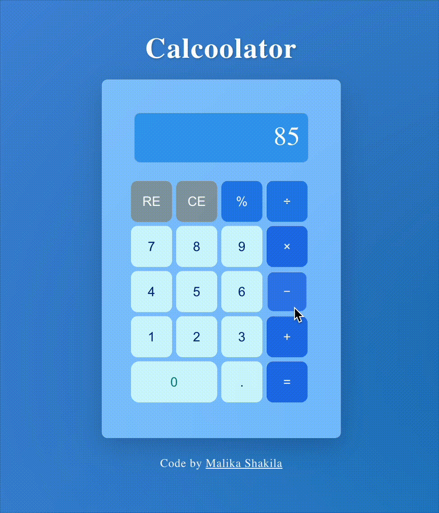

🧮 Calcoolator | React

An upgraded and modern version of a React calculator — built from scratch with better logic, keyboard support, and smooth UI animations.
This project was inspired by the Meta React Basics course calculator
, but rebuilt to be cleaner, more efficient, and much more interactive.

🧪 Preview
App Interface

🚀 Features

✅ Keyboard Input Support
Type numbers and operators directly from your keyboard!
Supports:
0–9, +, -, *, /, %, ., Enter (calculate), Backspace (delete one), and Escape (reset).

✅ Smart Backspace ("CE")
Deletes only one character at a time — just like the Delete key on your keyboard.

✅ Full Reset ("RE")
Resets everything — current value, previous value, and operator — in one click or by pressing Escape.

✅ Responsive and Smooth UI
Beautiful blur-glass interface with hover and press effects.
Each component fades and slides into view for a smooth animation on page load.

✅ Keyboard + Click Sync
All calculator buttons can be triggered via mouse and keyboard seamlessly.

✅ Header & Footer Branding
Personalized title and footer:

Calcoolator
Code by Malika Shakila

🧠 Logic Flow

The calculator tracks three main states using the React useState hook:

- currentValue — the number currently being entered.
- previousValue — the stored number from the previous operation.
- operation — the active operator (+, -, *, /, %).
- These states update dynamically based on user input, whether from button clicks or keyboard events.

⚙️ Core Logic

All button and keyboard actions are handled through a single handleInput() function, which uses a switch statement to manage:

- Number input (0–9)
- Operators (+, -, *, /, %)
- Decimal (.)
- Equals (= / Enter)
- Clear Entry (CE / Backspace)
- Reset All (RE / Escape)

Example:

case "clearEntry":
case "Backspace":
  if (currentValue === "" && operation) {
    setOperator(null);
    setCurrentValue(previousValue || "0");
    setPreviousValue(null);
  } else {
    setCurrentValue((prev) =>
      prev.length > 1 ? prev.slice(0, -1) : "0"
    );
  }
  break;

🧩 Keyboard Input Integration

A global keydown event listener inside a useEffect hook listens for key presses and maps them to the same handleInput() logic used by button clicks.

useEffect(() => {
  const handleKeyPress = (e) => {
    const validKeys = [
      "0","1","2","3","4","5","6","7","8","9",
      "+","-","*","/","%",".","=","Enter","Backspace","Escape"
    ];
    if (validKeys.includes(e.key)) {
      e.preventDefault();
      handleInput(e.key);
    }
  };

  window.addEventListener("keydown", handleKeyPress);
  return () => window.removeEventListener("keydown", handleKeyPress);
});

🎨 UI / UX Design

Built with custom CSS for a modern, semi-transparent “glass” interface and smooth transitions.

Visual Enhancements:

Fade-in + Slide-up animation when the page loads.

Press animation when hovering or clicking buttons.

Blurred glass panel effect using backdrop-filter.

Responsive layout for all screen sizes.

@keyframes fadeUp {
  from { opacity: 0; transform: translateY(20px); }
  to { opacity: 1; transform: translateY(0); }
}

.fade-up {
  animation: fadeUp 1s ease-out;
}

🛠️ Tech Stack

React 18+
JavaScript (ES6+)
CSS3 (with custom animations and gradients)
Hooks: useState, useEffect

💡 Future Improvements

Add dark/light mode toggle
Include scientific operations (√, x², 1/x)
Add local storage for calculation history

👩‍💻 About
Calcoolator — A React-based calculator app built and designed by
Malika Shakila
 ✨